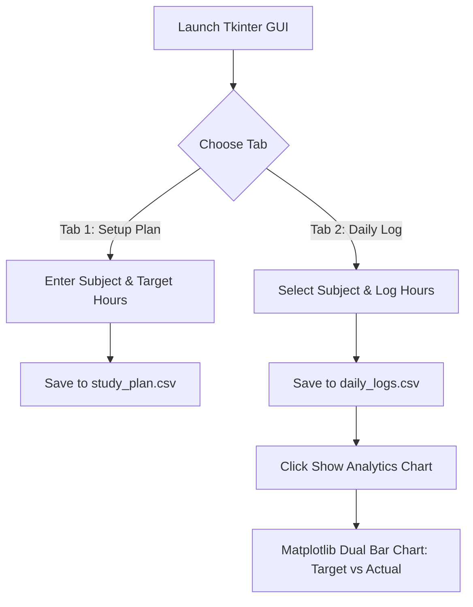

#  Smart Study Planner & Progress Tracker

<p align="center">
  
  
  
  
  
</p>

---

> 🎯 **A Desktop GUI Application** built with Python (`Tkinter`, `Pandas`, `Matplotlib`) to help students set subject targets, log daily study hours, and generate **Target vs Actual** progress analytics charts.

---

## 👨‍💻 Development Team

<table>
  <tr>
    <td align="center"><b>Kunal Kachare</b></td>
    <td align="center"><b>Vedant Kanhe</b></td>
    <td align="center"><b>Aditya Khanapure</b></td>
    <td align="center"><b>Mahesh Shivankhede</b></td>
  </tr>
</table>

---

## ✨ Key Features

- 🖥️ **Interactive Desktop GUI:** Modern tabbed interface built using Python `Tkinter` and `ttk`.
- 🎯 **Step 1: Goal & Target Setting:** Set total target study hours per subject with validation and duplicate checks.
- 📝 **Step 2: Daily Study Logger:** Dynamic dropdowns to record study dates, subjects, and hours completed.
- 💾 **Automated CSV Persistence:** Permanent data storage using `Pandas` (`study_plan.csv` & `daily_logs.csv`).
- 📊 **Target vs Actual Analytics:** Integrated `Matplotlib` & `NumPy` bar charts comparing target study hours against actual progress.

---

## 🛠️ Tech Stack & Libraries

| Tool / Library | Role & Functionality |
| :--- | :--- |
|  **Tkinter & ttk** | Graphical User Interface (GUI), Form Validation, & Notebook Tabs |
|  **Pandas** | Reading, updating, aggregating, and auto-saving CSV database files |
|  **NumPy** | Numerical position arrays for dual-bar alignment on Matplotlib charts |
| 📊 **Matplotlib** | Generating dynamic comparative bar charts (*Target vs Completed*) |

---

## 📂 Repository Structure

```text
SMART_STUDY_PLANNER/
│
├── 📂 source_code/
│   └── study_planner_app.py     # Main Python Tkinter GUI Application
│
├── 📂 data/
│   ├── study_plan.csv           # Stores subject targets (Auto-generated)
│   └── daily_logs.csv           # Stores daily logged study hours (Auto-generated)
│
├── 📂 screenshots/
│   ├── gui_tab1_plan.png        # Screenshot of Target Plan GUI Tab
│   ├── gui_tab2_logger.png      # Screenshot of Daily Logger GUI Tab
│   └── progress_chart.png       # Screenshot of Matplotlib Progress Chart
│
└── 📄 README.md                 # Project Documentation
```

---

## 🔄 App Architecture & Workflow



---

## 🚀 How to Run the Project Locally

### Prerequisites
Make sure you have Python installed, then install required libraries:

```bash
pip install pandas numpy matplotlib
```

### Execution Command
Run the main script using terminal or VS Code:

```bash
python study_planner_app.py
```

---

<p align="center">
  <b>⭐ If you find this project useful, don't forget to give it a star! ⭐</b><br>
  <i>Designed & Developed by Kunal, Vedant, Aditya, and Mahesh</i>
</p>
